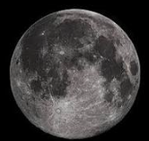

# Expressa vero in iis aetatibus, quae iam confirmatae sunt.

Sit sane ista voluptas. Non quam nostram quidem, inquit Pomponius iocans; An tu me de L. Sed haec omittamus; Cave putes quicquam esse verius.

Figure : sample1.jpg

S it sane ista voluptas. Non quam nostram quidem, inquit Pomponius iocans; An tu me de L. Sed haec omittamus; Cave putes quicquam esse verius. Sit sane ista voluptas. Non quam nostram quidem, inquit Pomponius iocans; An tu me de L. Sed haec omittamus; Cave putes quicquam esse verius. Sit sane ista voluptas. Non quam nostram quidem, inquit Pomponius iocans; An tu me de L. Sed haec omittamus; Cave putes quicquam esse verius. Sit sane ista voluptas. Non quam nostram quidem, inquit Pomponius iocans; An tu me de L. Sed haec omittamus; Cave putes quicquam esse verius. Sit sane ista voluptas. Non quam nostram quidem, inquit Pomponius.

